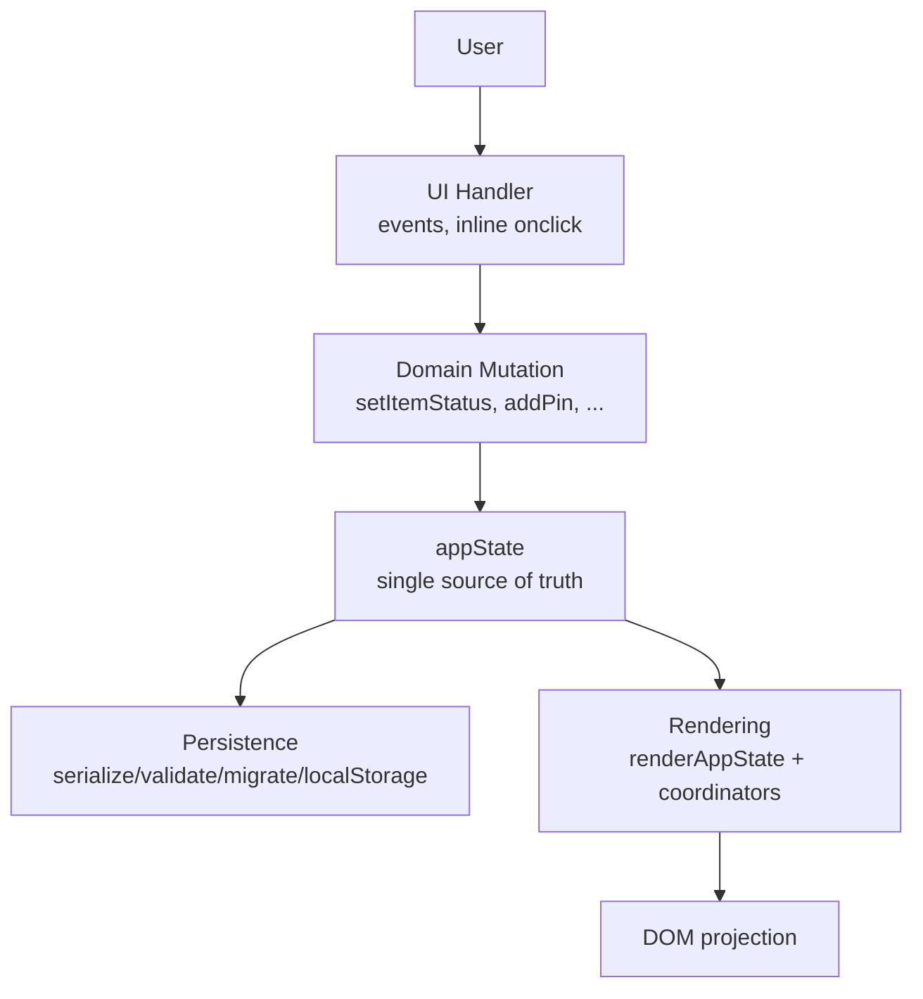

# Architecture Overview

**Status: Current**

## Purpose

Explain how the application is organized and how data flows through it. Everything described here is implemented in `js/app.js` and verified by the test suite.

## Layer Model



## Concepts

| Concept | Location | Description |
| --- | --- | --- |
| **Domain State** | `appState` | `{ schemaVersion, activeProductId, products }` — the only authoritative review data |
| **Transient UI State** | module-level variables | comment/title/zoom state, context menus, dialogs, `signOffUiState`, `signaturePadState`, toast timer — never persisted |
| **Session Resources** | `artworkSessions` | `Map<productId, Map<layerId, {metadata, objectUrl}>>` — binary artwork + Object URLs, runtime only |
| **Persistence Layer** | functions in js/app.js | `serializeState`, `validateState`, `migrateState`, `saveStateToStorage`, `loadStateFromStorage`, `buildExportData`, `applyImportedReview` |
| **Rendering Layer** | named `render*` coordinators | Project `appState` into the DOM; see [rendering-model.md](rendering-model.md) |
| **Validation** | `validate*` functions | Storage, import and business-rule validation before any mutation |
| **Migration** | `migrate*` functions | v1→v2→v3→v4→v5 chains for storage and import files; see [persistence-and-schema.md](persistence-and-schema.md) |
| **File Handling** | `handleArtworkFileChange`, `handleCheckFileChange` | Image upload (session-only) and JSON import (validated) |
| **Tests** | `js/tests/` | Modular browser test suite; see [engineering/testing-strategy.md](../engineering/testing-strategy.md) |

## Data Flow (typical user action)

1. User clicks **Approve** on item `1a` → inline `onclick` → `handleReviewAction("1a", "approved")`.
2. `handleReviewAction` validates, mutates `appState.products[active].items["1a"].status`, touches `updatedAt`.
3. It re-renders (`renderItemState`, `updateProgress`) and persists (`saveStateToStorage`).
4. The DOM updates as a projection of state; no DOM state is read back as authoritative.

```mermaid
sequenceDiagram
  participant U as User
  participant H as UI Handler
  participant D as Domain Mutation
  participant S as appState
  participant R as Render
  participant P as localStorage
  U->>H: click Approve
  H->>D: handleReviewAction(id, approved)
  D->>S: item.status = approved; updatedAt = now
  D->>R: renderItemState + updateProgress
  D->>P: saveStateToStorage()
```

## Mutations Are Centered

Almost every user action resolves to a small named domain function:

- Review: `setItemStatus`, `setItemComment`, `setItemCurrentTitle`, `setItemPinForLayer`, `handleReviewAction`, `restoreOriginalTitle`.
- Products: `createNewProduct`, `switchProduct`, `renameProduct`, `duplicateProduct`, `deleteProduct`.
- Layers: `createArtworkLayerForProduct`, `switchArtworkLayer`, `renameArtworkLayer`, `deleteArtworkLayerWithDialog`, `addArtworkLayer`.
- Artwork: `applyArtworkIdentity`, `adoptSessionArtwork`, `releaseLayerSessionArtwork`.
- Pins: `addPin`, `clearPins`, `removeItemPinFromLayer`.
- Import/export: `exportReviewAsJson`, `openCheck`, `applyImportedReview`.
- Sign-off: `updateActiveReviewer`, `setDepartmentSignOffStatus`, `setDepartmentSignOffComment`, `setDepartmentSignature`, `computeOverallApproval`.

## Validation and Migration Boundaries

- **localStorage read path**: `getStoredStateRecord` → `deserializeState` → `migrateState` → `validateState` → `rehydrateState`. Any failure leaves the in-memory state untouched.
- **Import path**: file read → `migrateImportData` → `validateImportData` → `buildImportedProduct` → insert as a new product → render.
- **Business rules** are enforced separately from structural persistence validation. This allows an incomplete rejection to survive autosave while still blocking final approval.

See [persistence/import-export.md](../persistence/import-export.md) and [persistence/migrations.md](../persistence/migrations.md).

## What the Application Is Not

- No backend, no database, no network calls (the app never transmits review data).
- No framework, no module system (classic scripts; `js/app.js` + `js/tests.js` loaded via `<script>`).
- No build step: the repository is served as-is.

## Why This Architecture Works for the MVP

- Single `appState` makes serialization trivial (`serializeState` is `JSON.stringify(appState)`).
- DOM rebuilds are cheap at this scale (50 items, few products/layers).
- Session-only binaries keep `localStorage` small and avoid quota problems.
- The architecture is documented for the moment it no longer fits: see [future/future-architecture.md](../future/future-architecture.md).

## Related Documents

- [data-model.md](data-model.md) — exact models.
- [state-management.md](state-management.md) — what lives in state and what does not.
- [rendering-model.md](rendering-model.md) — render coordinator responsibilities.
- [persistence-and-schema.md](persistence-and-schema.md) — storage and schema history.
- [engineering/tech-stack.md](../engineering/tech-stack.md) — stack decisions.
- [decisions/ADR-002-appstate-single-source-of-truth.md](../decisions/ADR-002-appstate-single-source-of-truth.md)
