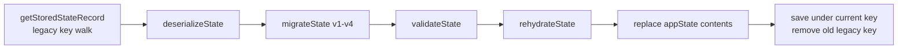

# Persistence and Schema

**Status: Current**

## Purpose

Document the versioned persistence layer: schema, storage keys, the load pipeline, serialization/validation/rehydration, and the migration chain. Deep-dive companions: [serialization.md](../persistence/serialization.md), [migrations.md](../persistence/migrations.md), [import-export.md](../persistence/import-export.md).

## Constants (js/app.js)

| Constant | Value | Line |
| --- | --- | --- |
| `CURRENT_SCHEMA_VERSION` | `4` | 129 |
| `STORAGE_KEY` | `` `artworkChecklist:v${CURRENT_SCHEMA_VERSION}` `` → `"artworkChecklist:v4"` | 5391 |
| `LEGACY_STORAGE_KEYS` | `["artworkChecklist:v3", "artworkChecklist:v2", "artworkChecklist:v1"]` | 5393 |

## Schema History

| Version | Major change | Migration |
| --- | --- | --- |
| v1 | Initial centralized review state (`appState`), pixel pins `{x, y}`, single product, single artwork | — |
| v2 | Normalized pins (`xRatio`/`yRatio` in 0..1) | `migrateStateV1ToV2` |
| v3 | Multi-layer artwork: `artworkLayers[]`, `activeArtworkLayerId`, per-layer pins `{layerId, xRatio, yRatio}` | `migrateStateV2ToV3` |
| v4 | Canonical checklist item **6I** "Pantone Colours Match Approved Pack Copy?" (50 items); Pantone compliance moved from a colour registry to the checklist | `migrateStateV3ToV4` + `addPantoneComplianceItem` |

This history is supported by code and tests: v1/v2/v3 fixtures are migrated and asserted in `js/tests/layers/d-persistence.test.js`, `g4-multi-layer-artwork.test.js` and `g5-pantone-compliance.test.js`.

## localStorage Lifecycle

### Save

`saveStateToStorage()`:

1. `serializeState()` → `JSON.stringify(appState)`.
2. `localStorage.setItem(STORAGE_KEY, serialized)`.
3. On quota/browser error: `console.error`, return `false` — the application keeps running.

### Load

`loadStateFromStorage()`:

- `getStoredStateRecord()`: reads `STORAGE_KEY` first; if absent, walks `LEGACY_STORAGE_KEYS` in order and returns `{key, serializedState}`.
- `deserializeState()`: `JSON.parse` in try/catch → `null` on malformed JSON (never crashes startup).
- `migrateState()`: current version returned unchanged; v3→v4; v2→v3→v4; v1→v2→v3→v4; unsupported version → `console.warn` + `null`.
- `validateState()`: structural workspace validation (see [data-model.md](data-model.md)).
- `rehydrateState()` → `rehydrateProduct` → `rehydrateItems`: builds a **fresh object graph** (no references into parsed JSON), restores the immutable `originalTitle` from canonical definitions, clones pins, merges reviewer/signature/timestamps.
- After a successful legacy-key load, the state is saved under the current key and the old key is removed (failure is `console.warn`ed).

**Guarantee:** any failure in the pipeline leaves the in-memory `appState` untouched — the app falls back to the default seeded product.

## Migration Chain Detail

| Function | Contract |
| --- | --- |
| `migrateItemsPinsToV2(items, dimensions)` | Per-item pin conversion: null→null; normalized→copy; legacy `{x,y}`→ratios via `convertLegacyPixelPin`; else throw |
| `migrateStateV1ToV2(state)` | Deep-clones, converts all item pins, sets `schemaVersion=2` |
| `migrateStateV2ToV3(state)` | Wraps `product.artwork` into `artworkLayers:[{id:"layer-main",name:"Main Artwork"}]`, moves `item.pin` → `item.pins:[{layerId:"layer-main",...}]`, sets active layer |
| `addPantoneComplianceItem(items)` | Adds canonical `6i` (Pending) when missing; shared by state and import migration; never touches `pantoneColors` |
| `migrateStateV3ToV4(state)` | Deep-clones; per-product `addPantoneComplianceItem`; `schemaVersion=4` |
| `migrateState(state)` | Orchestrator; never mutates input (each step clones) |
| `migrateLegacyItemsToV2(items)` | Standalone items-level v1→v2 compat helper |
| `migrateImportData(data)` | Import-file variant (different top-level shape) — see [import-export.md](../persistence/import-export.md) |

Migration philosophy: **non-destructive, cloning-based, validated after**. Legacy data (including `pantoneColors`) is preserved; only the missing canonical structure is added. See [migrations.md](../persistence/migrations.md).

## Error Handling Summary

| Failure | Behaviour |
| --- | --- |
| Malformed JSON in storage | `deserializeState` → null; app starts with default state |
| Unsupported schema version | `migrateState` → null; app starts with default state |
| Quota exceeded on save | `console.error`, return false; UI continues (no toast) |
| Legacy key save/replacement fails | `console.warn`; data stays under old key |
| Invalid imported file | Rejected with a toast; current state untouched |

## Schema Compatibility Rules

1. `validateState` requires **exactly** `schemaVersion === 4` — v1/v2/v3 in-memory states are invalid and must be migrated first.
2. Imports of v1/v2/v3 files are migrated by `migrateImportData` before validation (`validateImportData`).
3. Exports always carry the current `schemaVersion` (via `buildExportData`).
4. Round-trip stability (serialize → deserialize → serialize) is asserted by tests.

## Related Documents

- [persistence/migrations.md](../persistence/migrations.md)
- [persistence/serialization.md](../persistence/serialization.md)
- [persistence/import-export.md](../persistence/import-export.md)
- [persistence/legacy-compatibility.md](../persistence/legacy-compatibility.md)
- [decisions/ADR-003-versioned-local-persistence.md](../decisions/ADR-003-versioned-local-persistence.md)