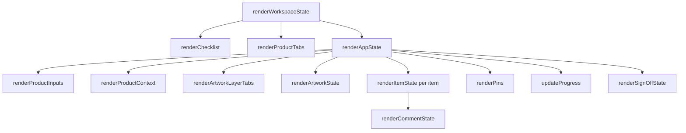

# Rendering Model

**Status: Current**

## Purpose

Document the state → render → DOM projection: which renderer exists, what it reads, what it writes, and who calls it. All functions are in `js/app.js`.

## Principle

The DOM is a **projection** of `appState`. Renderers are pure-ish: they read domain state (plus minimal transient UI state) and rebuild DOM fragments. Event handlers do not store authoritative data in the DOM.

## Render Coordinator Hierarchy

## Renderer Inventory

### `renderAppState()` — main coordinator (active product)

- **Reads:** active product (fields, layers, items, active layer), `artworkSessions`, transient UI (`editingTitleItemId`, `openCommentItemIds`).
- **Writes:** product inputs, context header, artwork layer tabs, artwork viewer state, per-item DOM, pins layer, progress and sign-off header/open panel.
- **Does not do:** rebuild the whole checklist (`renderChecklist` handles that), rebuild product tabs.
- **Called by:** `loadStateFromStorage` pipeline, domain mutations (via helpers), tests.

### `renderWorkspaceState({scrollActiveTab, rebuildChecklist})`
- **Reads:** `appState`.
- **Writes:** checklist (when `rebuildChecklist`), product tabs, then `renderAppState`; optionally scrolls the active tab into view.
- **Called by:** product operations (create/rename/duplicate/delete/switch), import (`applyImportedReview`).

### `renderChecklist()`
- **Reads:** `sectionDefinitions`, active product items.
- **Writes:** `#checklist` — section buttons (`.section-btn`) and items (`.check-item[data-id]`).
- **Does not do:** render item internals (status/comments) — `renderItemState` per item does that.

### `renderItemState(itemId)`
- **Reads:** item state, `editingTitleItemId`.
- **Writes:** `.check-item-title`, edit input visibility/value, Edited badge, correction meta, status label (`[data-role="status-label"]`), approve/reject button states (`aria-pressed`, `.active`), `data-status`/`data-edited`; then calls `renderCommentState`.
- **Called by:** `renderAppState`, review actions, title editing flows.

### `renderCommentState(itemId)`
- **Reads:** item comment, `validateItemState`, `openCommentItemIds`.
- **Writes:** comment panel visibility, textarea value, `aria-invalid`, comment button `.has-comment`/`aria-expanded`, inline error (`[data-role="comment-error"]`), `data-valid`.

### `renderProductTabs()`
- **Reads:** `appState.products`, `activeProductId`.
- **Writes:** `#product-tabs` (`.product-tab[data-product-id]`, `role="tab"`, `aria-selected`); closes the product context menu.

### `renderProductContext()`
- **Reads:** active product.
- **Writes:** `#ctx-product`, `#ctx-code`, `#ctx-site`, `#ctx-artwork-rev`.

### `renderProductInputs()`
- **Reads:** active product fields.
- **Writes:** `#inp-brand`, `#inp-name`, `#inp-weight`, `#inp-sku`, `#inp-production-code`, `#inp-site`, `#inp-artwork-version`.

### `renderArtworkLayerTabs()`
- **Reads:** product layers, `activeArtworkLayerId`.
- **Writes:** `#artwork-layer-tabs` (`.artwork-layer-tab[data-layer-id]`, `role="tab"`, `aria-selected`); closes the layer context menu.

### `renderArtworkState()`
- **Reads:** active layer `artwork` metadata, `artworkSessions`.
- **Writes:** tri-state of `#demo-artwork` / `#artwork-image` / `#artwork-missing` (`hidden` flags), `#artwork-status-badge`, `#artwork-meta`, `#btn-artwork` label, `pinsLayer.hidden`.
- **Does not do:** load or revoke Object URLs (session layer owns those).

### `renderPins()` — / `renderPin(itemId)`
- **Reads:** items + active layer id; pins of the **active layer only**.
- **Writes:** `#pins-layer` pin elements (`.pin[data-item-id][data-pid][data-layer-id]`, tooltip = `currentTitle`).
- **Note:** `setItemPinForLayer` does **not** render; use `addPin` (which calls `renderPin`) or `renderPins` after bulk changes.

### `updateProgress()`

- **Reads:** active product items.
- **Writes:** counters `#progress-total` / `#progress-approved` / `#progress-rejected` / `#progress-pending`, percentages `#progress-review-pct` (`N% reviewed`) / `#progress-approval-pct` (`N% approved`), and `#progress-bar` width (reviewed / total).
- **Not a `render*` function** but part of the projection.

### `renderSignOffState()` / `renderSignOffOverview()` / `renderDepartmentSignOffs()`

- **Reads:** active product reviewer, sign-offs, required fields, checklist validity and transient `signOffUiState`.
- **Writes:** header Sign-Off status, derived overall badge/message, reviewer form, blocker list and the three department cards.
- `renderSignOffOverview` intentionally avoids rebuilding department textareas while typing; `renderDepartmentSignOffs` rebuilds cards after decision-level changes.
- Signature canvas pixels are transient until Confirm; the persisted `DepartmentSignature` then drives the `Signed` preview.

### Legacy renderers (unused by current UI)

- `renderPantoneColours()` and `renderPantoneColourEditorLayers()` rebuild the retired Colour Specification UI. They are retained for historical compatibility but **nothing calls them** — the G5 test suite asserts the component element does not exist (`document.getElementById("colour-specification") === null`).

## Render/Update Discipline

- After any mutation: render the affected region, then persist (`saveStateToStorage`).
- Rebuilding larger regions (tabs, checklist) is acceptable at this scale; see [performance-considerations.md](../quality/performance-considerations.md).
- The test helpers `restoreSnapshot` (js/tests/core/helpers.js) re-render via `renderChecklist`, `renderProductTabs`, `renderAppState` — the same public coordinators the app uses.

## Related Documents

- [state-management.md](state-management.md)
- [architecture-overview.md](architecture-overview.md)
- [quality/performance-considerations.md](../quality/performance-considerations.md)
