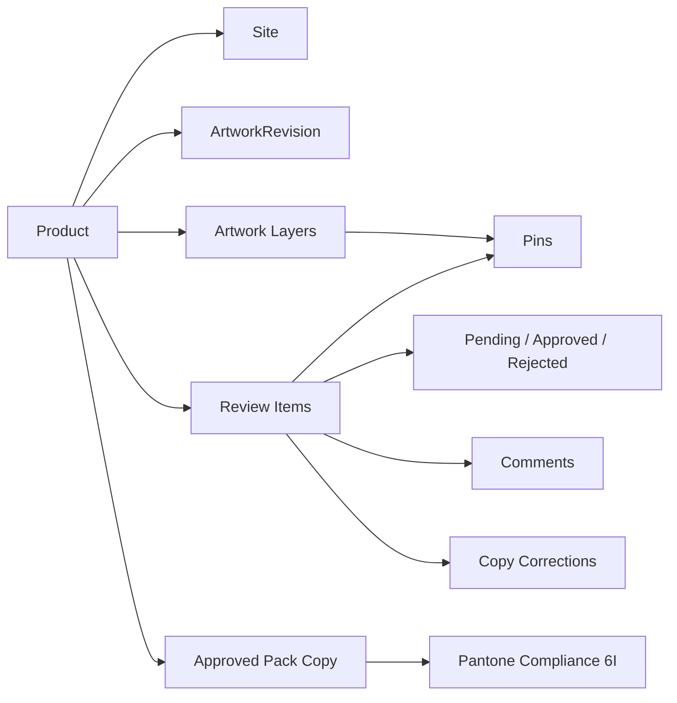

# Domain Overview

**Status: Current**

## Purpose

Explain the business concepts of the Artwork & Pack Copy Checklist and mark which are implemented vs planned.

## Concept Map

## Concepts (implemented)

| Concept | Definition in this project | Where |
| --- | --- | --- |
| **Product** | A reviewed food product: brand, name, weight, SKU, production code, site, artwork revision | `appState.products`, [data-model.md](../architecture/data-model.md) |
| **Site** | One of the allowed sites `OH1` / `OH2` / `BL` (`ALLOWED_SITES`) | product field `site` |
| **Artwork Revision** | Version label of the artwork under review (textual; separate from app version) | product field `artworkVersion` |
| **Artwork Layer** | A surface/page of the artwork (e.g. Front, Back, Sleeve); each layer has its own artwork metadata and pins | `artworkLayers[]`, [artwork-workspace.md](../architecture/artwork-workspace.md) |
| **Review Item** | One checklist requirement (canonical: 50 items in 6 sections) | `sectionDefinitions`, [data-model.md](../architecture/data-model.md) |
| **Status** | Single enum per item: `pending` / `approved` / `rejected` | `REVIEW_STATUSES`, [review-workflow.md](review-workflow.md) |
| **Comment** | Free-text note per item; mandatory when rejected | item `comment` |
| **Copy Correction** | `originalTitle` (immutable) vs `currentTitle` (editable) with Edited indicator and Restore original | C3 layer |
| **Pin** | A normalized (`xRatio`,`yRatio`) annotation tying an item to a location on one artwork layer | [pins-and-coordinate-system.md](../architecture/pins-and-coordinate-system.md) |
| **Pack Copy** | The approved packaging text that artwork must match (the reviewer's reference; not stored in-app beyond the checklist) | — |
| **Pantone Compliance** | Checklist item **6I — "Pantone Colours Match Approved Pack Copy?"** — the reviewer verifies artwork colours against the approved pack copy | G5 layer, [review-workflow.md](review-workflow.md) |
| **Review Progress** | "X / 50 reviewed" (approved + rejected); approval-rate metrics are future F1 | `updateProgress` |

## Concepts (planned — not implemented)

| Concept | Status | Planned layer |
| --- | --- | --- |
| **Reviewer** | Field exists in the model (`{name, role, reviewedAt}`) but no UI writes it | H1 |
| **Signature** | Field exists (`product.signature = null`), never populated | H3 |
| **Department Sign-Off** | Independent approvals by Quality / Production / Product Development | H2 |
| **Report / PDF** | Printable report and print view | J1–J3 |
| **Artwork Revision history** | Versioned revisions with per-revision checklists | M3 |
| **Audit trail** | Who did what, when | M4 |

## The Checklist Domain (canonical)

6 sections, 50 items (source: `sectionDefinitions`, js/app.js:191):

| # | Section | Items |
| --- | --- | --- |
| 1 | Legal Core (BRCGS 5.2.1) | 1a–1j (10) |
| 2 | Ingredients & Allergens | 2a–2e (5) |
| 3 | Nutrition & Serving | 3a–3j (10) |
| 4 | Storage & Cooking | 4a–4d (4) |
| 5 | Claims & Certifications | 5a–5l (12) |
| 6 | Packaging, Marks & Languages | 6a–6i (9) — includes **6I Pantone Colours Match Approved Pack Copy?** |

## Pack Copy and Pantone — Positioning

- The **approved pack copy is the authoritative source** for what the packaging must say and which Pantone colours it must use. The application does **not** define Pantone colours and does not derive RGB/HEX values.
- Pantone compliance is a **checklist decision** (6I), not a colour registry. The legacy `pantoneColors` registry is preserved only for data compatibility (see [legacy-compatibility.md](../persistence/legacy-compatibility.md)).

## Related Documents

- [review-workflow.md](review-workflow.md) — the operational flow.
- [business-rules.md](business-rules.md) — formal rules.
- [data-dictionary.md](data-dictionary.md) — field reference.
- [glossary.md](glossary.md) — terminology.