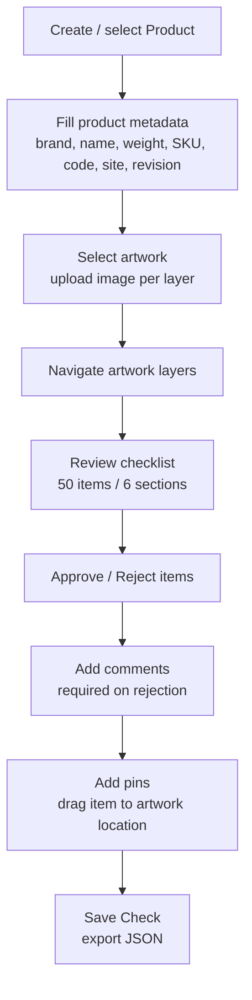

# Review Workflow

**Status: Current**

## Purpose

Document the operational review workflow as implemented, including status transitions, rejection rules, and the Pantone compliance item 6I.

## End-to-End Flow



## Status Transitions

Each item has exactly one status: `pending` / `approved` / `rejected` (`REVIEW_STATUSES`).

| From | Action | To |
| --- | --- | --- |
| pending | click Approve | approved |
| pending | click Reject | rejected (comment panel opens) |
| approved | click Approve again | pending (toggle) |
| approved | click Reject | rejected |
| rejected | click Reject again | pending (toggle) |
| rejected | click Approve | approved |

Implementation: `handleReviewAction(itemId, requestedStatus)` — approve/reject toggle, opens and focuses the comment textarea on reject, re-renders, persists.

## Rejection Rule

```
IF status = rejected
THEN comment.trim().length > 0
```

- Enforced at interaction time by `validateItemState` and surfaced inline (`[data-role="comment-error"]`: "Comment required…"); typing a comment clears the error.
- `validateActiveProduct` aggregates invalid items across the active product (prefixed `ID:`).
- Rejecting without a comment is allowed to be *pending a comment* in the UI (the panel opens), but the item is flagged invalid until the comment is written.

## Review Progress

- `updateProgress`: updates the progress footer — counters (total/approved/rejected/pending) and percentages `N% reviewed` / `N% approved`; reviewed = approved + rejected, and the bar always follows reviewed / total.
- Per-status counters and an approval percentage are **not** implemented (roadmap F1).

## Comments

- `toggleCommentPanel` / `openCommentPanel` manage the open panel set (`openCommentItemIds`).
- Comments persist per item and survive reload, export/import, duplication.

## Copy Corrections

- `originalTitle` is immutable; `currentTitle` is editable via inline edit (Enter commits, Escape cancels, Blur commits/cancels per `commitTitleEdit`).
- Edited items show an `Edited` badge and `Restore original` (`restoreOriginalTitle`).
- Pin tooltips use `currentTitle`.

## Pins

- Drag a checklist item onto the artwork (`#pins-layer` drop) → normalized pin on the **active layer**.
- One pin per (item, layer); an item can be pinned on several layers.
- Click a pin → scrolls to the item; hover an item → highlights its pin.
- `Clear Pins` clears the active layer's pins.

## Pantone Compliance — Item 6I

Canonical item:

```text
6I — Pantone Colours Match Approved Pack Copy?
Note: Verify the artwork uses the Pantone colours specified in the approved pack copy
```

Operational meaning:

1. The reviewer compares the artwork's colours with the **approved pack copy** Pantone specification.
2. **The pack copy is authoritative** — the application does not define Pantone colours, does not store RGB/HEX equivalents and performs no automatic colour reading.
3. The decision is recorded exactly like any other checklist item: Pending / Approved / Rejected, mandatory comment on rejection, per-layer pins, persistence, export/import.
4. On schema migration from v3, 6I is added as **Pending** to every product; legacy `pantoneColors` never influences its status.

**Do not describe the legacy `pantoneColors` registry as part of the current business workflow** — it is preserved only for backwards compatibility with v3 review files ([legacy-compatibility.md](../persistence/legacy-compatibility.md), [decisions/ADR-009-pantone-pack-copy-compliance.md](../decisions/ADR-009-pantone-pack-copy-compliance.md)).

## Save Check / Open Check

| Step | Action | Behaviour |
| --- | --- | --- |
| Save Check | `exportReviewAsJson()` | Downloads schema-v4 JSON of the active product via `buildExportData` |
| Open Check | `openCheck()` → `handleCheckFileChange` | Reads `.json`, `migrateImportData`, `validateImportData`, imports as a **new product**, activates it |

See [persistence/import-export.md](../persistence/import-export.md).

## Related Documents

- [domain-overview.md](domain-overview.md)
- [business-rules.md](business-rules.md)
- [quality/manual-regression-guide.md](../quality/manual-regression-guide.md)