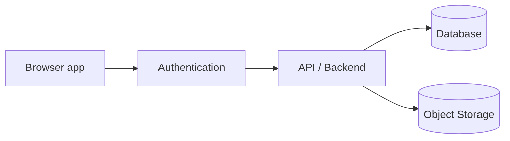

# Future Architecture

**Status: Future / Not Implemented**

> This document describes **possible** evolution. Nothing here exists in the repository today, and nothing here is a commitment. It exists so future architecture is never confused with current architecture.

## Evolution Triggers (not promises)

| Driver | Would trigger |
| --- | --- |
| Multiple users | Central persistence, authentication |
| Cross-machine reviews | Backend API |
| Audit requirements | Immutable audit trail, revision history |
| Shared artwork storage | Object storage |
| Cross-functional approvals | Department sign-off workflow (planned H) |
| Reporting needs | Report model + print/PDF (planned J) |
| Large product/team scale | Module separation, search/filter, dashboards |

## Possible Future Shape

This shape is **illustrative only**: concrete technologies (framework, language, database vendor) are deliberately not chosen until the planned decides them.

## What Would NOT Change

- The domain model (products, layers, items, pins) is storage-agnostic and would survive a backend transition.
- The review workflow (Pending/Approved/Rejected, comments, pins, 6I) is the product's core value and stays.
- The checklist content (6 sections, 50 items) is the regulatory representation and stays.

## Architectural Debt That Constrains the Future

| Constraint | Implication |
| --- | --- |
| `js/app.js` is one classic script (~9,860 lines) | Module split (planned L1) should precede large future features |
| State discipline is by convention | A backend client layer must respect the same mutation/validation boundaries |
| No report model | planned J must introduce `buildReportData(product)` before any print/PDF |
| No revision model | planned M3 must introduce Product → Artwork → Revision before audit history |

## Related Documents

- [backend-transition.md](backend-transition.md) — the concrete migration map if a backend appears.
- [layer-planning.md](layer-planning.md) — layer dependencies.
- [quality/security-considerations.md](../quality/security-considerations.md) — future security requirements.
- [docs/README.md](../README.md) — CURRENT vs FUTURE labeling policy.