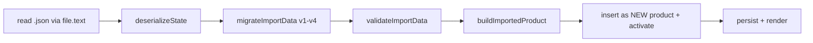

# Import / Export

**Status: Current**

## Purpose

Document Save Check (export) and Open Check (import): canonical structure, validation pipeline, migration, rehydration, failure behaviour and security considerations.

## Save Check (export)

Flow: `exportReviewAsJson()` (js/app.js:6589) → `buildExportData()` (6531) → `downloadJsonFile(data, filename)` (6745).

`buildExportData` exports the **active product only**:

```json
{
  "schemaVersion": 4,
  "exportedAt": "…ISO…",
  "product": { "id", "brand", "productName", "weight", "sku",
               "productionCode", "site", "artworkVersion",
               "createdAt", "updatedAt" },
  "items": { "1a": { "id", "sectionId", "originalTitle", "currentTitle",
                     "status", "comment", "pins": [{"layerId","xRatio","yRatio"}] }, "…" },
  "artworkLayers": [ { "id", "name", "artwork": { "name","type","size","width","height" } } ],
  "activeArtworkLayerId": "layer-main",
  "pantoneColors": [ { "id", "name", "pantoneCode", "notes", "layerIds" } ],
  "reviewer": { "name", "role", "reviewedAt" }
}
```

- Filename includes product name + timestamp.
- Download is a `Blob` + Object URL + `<a download>`, revoked in `finally`.
- **Legacy export**: `buildLegacyCheckData()` (js/app.js:6669) + `saveCheck()` (6732) produce the baseline format (boolean `checks`, pixel `pins`, `product:{brand,name,weight,sku}`, `timestamp`) — retained for historical consumers. See [legacy-compatibility.md](legacy-compatibility.md).

## Open Check (import)

Flow: `openCheck()` (9664) → `selectCheckFile()` (9668) → `handleCheckFileChange(event)` (9692) → `applyImportedReview(importedData)` (9592).

Validation pipeline:



| Step | Behaviour |
| --- | --- |
| File type | Only `.json` accepted (accept attribute + check) |
| Parse | `deserializeState` — malformed JSON rejected with toast |
| Migration | `migrateImportData` (see [migrations.md](migrations.md)) — v1/v2/v3 files promoted to v4 |
| Validation | `validateImportData` (9388) builds a candidate product and runs `validateSerializedProduct` — invalid structure rejected with toast, current state untouched |
| Build | `buildImportedProduct` (9508) via `createProduct` + `rehydrateItems` + `createArtworkLayer`; `updatedAt` = now |
| Insert | ID-collision resolution via `generateProductId`; imported review becomes a **new product** (never overwrites the workspace) and is activated |
| Finish | `resetTransientReviewUiState`, save, `renderWorkspaceState({rebuildChecklist:true, scrollActiveTab:true})` |

## Failure Behaviour

| Failure | Result |
| --- | --- |
| Non-JSON file selected | Toast rejection; nothing changes |
| Malformed JSON | Toast rejection; nothing changes |
| Unsupported schema / invalid structure | `validateImportData` → null → toast; nothing changes |
| Valid v1/v2/v3 file | Migrated and imported as v4 |
| ID collision | Fresh ID generated; import succeeds |

## Security Considerations

- Imported JSON is **untrusted input**: it is parsed, structurally validated (`validateSerializedProduct`) and rehydrated into a **fresh object graph** — parsed objects never enter `appState` by reference, and user content is rendered with `textContent`, not injected HTML.
- No remote data: files never leave the browser; import is local-only.
- The imported product can carry legacy fields (e.g. `pantoneColors`); they are validated and preserved as compatibility data, never executed.

## Representative Example (abbreviated)

```json
{
  "schemaVersion": 4,
  "exportedAt": "2026-08-19T10:00:00.000Z",
  "product": {
    "id": "product-1",
    "brand": "PAULIG",
    "productName": "Premium Basmati Rice",
    "weight": "250g",
    "sku": "PRD-00458"
  },
  "items": {
    "6i": {
      "id": "6i",
      "sectionId": "packaging-marks-languages",
      "originalTitle": "Pantone Colours Match Approved Pack Copy?",
      "currentTitle": "Pantone Colours Match Approved Pack Copy?",
      "status": "pending",
      "comment": "",
      "pins": []
    }
  },
  "artworkLayers": [
    { "id": "layer-main", "name": "Main Artwork", "artwork": null }
  ],
  "activeArtworkLayerId": "layer-main",
  "pantoneColors": []
}
```

## Related Documents

- [architecture/persistence-and-schema.md](../architecture/persistence-and-schema.md)
- [persistence/migrations.md](migrations.md)
- [persistence/serialization.md](serialization.md)
- [persistence/legacy-compatibility.md](legacy-compatibility.md)
- [engineering/error-handling.md](../engineering/error-handling.md)