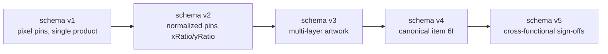

# Migrations

**Status: Current**

## Purpose

Deeply document the migration strategy: philosophy, the full chain v1→v2→v3→v4→v5, legacy storage keys, and the tests that protect migrations.

## Migration Philosophy

1. **Non-destructive**: migration only *adds* the missing canonical structure; it never deletes or rewrites existing review data (statuses, comments, pins, layers, timestamps, legacy `pantoneColors`).
2. **Cloning**: every step deep-clones the input; no step mutates its input, so a failed migration cannot corrupt the source.
3. **Validated after**: migrated state passes `validateState` before it is used.
4. **Backward compatible**: unknown/legacy fields that are still meaningful are carried over; the canonical item set is always completed.
5. **Centralized**: one orchestrator (`migrateState`) and one import variant (`migrateImportData`) — no ad-hoc migration scattered across the codebase.

## The Chain

| Step | What changes | Function |
| --- | --- | --- |
| **v1 → v2** | `item.pin` `{x, y}` pixels → `{xRatio, yRatio}` using artwork base dimensions | `migrateStateV1ToV2` → `migrateItemsPinsToV2` → `convertLegacyPixelPin` |
| **v2 → v3** | `product.artwork` → `artworkLayers: [{id:"layer-main", name:"Main Artwork"}]`; `item.pin` → `item.pins: [{layerId:"layer-main", ...}]`; `activeArtworkLayerId` added | `migrateStateV2ToV3` |
| **v3 → v4** | Adds canonical checklist item **6I** ("Pantone Colours Match Approved Pack Copy?", Pending) to every product; `pantoneColors` preserved untouched | `migrateStateV3ToV4` → `addPantoneComplianceItem` |
| **v4 → v5** | Assigns the three canonical required department sign-offs as Pending (replacing any non-schema-v4 `signOffs` field); existing reviewer and legacy product signature are preserved; no approval is inferred | `migrateStateV4ToV5` → `addCrossFunctionalSignOffs` |

Orchestrator: `migrateState(state)` — returns the current schema unchanged, runs the appropriate chain steps, and returns `null` (with `console.warn`) for unsupported versions.

## Legacy Storage Key Handling

- `STORAGE_KEY = "artworkChecklist:v5"`; `LEGACY_STORAGE_KEYS = ["artworkChecklist:v4", "artworkChecklist:v3", "artworkChecklist:v2", "artworkChecklist:v1"]`.
- `getStoredStateRecord()` : reads the current key first, then walks legacy keys in order.
- `loadStateFromStorage()` : after a successful legacy load, saves under the current key and removes the old key (failure only `console.warn`s).
- Result: older reviews are promoted to v5 storage exactly once.

## Import Migration (files)

`migrateImportData(data)` implements the same chain for **review files**, whose top-level shape differs from `appState`:

- v1 file → pins→v2 → recurse → v2/v3/v4/v5 steps.
- v2 file → layer wrap/pins arrays → v3 → 6I → v4 → sign-offs → v5.
- v3 file → 6I → v4 → sign-offs → v5.
- v4 file → `addCrossFunctionalSignOffs` → v5.
- Unsupported/invalid → `null` → import rejected.

Note: import payloads have no `products` wrapper, so workspace migration functions cannot be applied directly. Import branches use the shared `addPantoneComplianceItem` and `addCrossFunctionalSignOffs` helpers on the top-level review payload.

## Tests Protecting Migrations

| Area | Tests |
| --- | --- |
| v1→v2 pin conversion | `D` layer (legacy pixel pins), `E1` (legacy pixel pin migration) |
| v2→v3 layer wrap | `G4A-039`-adjacent validation, `g4-multi-layer-artwork.test.js` migration tests |
| v3→v4 6I insertion | `G5R-011`-range: migrated products gain 6I Pending, `pantoneColors` preserved |
| v4→v5 department insertion | `H-040`, `H-047`: v5 key/legacy order and conservative Pending migration |
| Import migration | `G5R-032`/`G5R-033` (v2/v3 file import), `D4` import tests |
| Corrupted/unsupported states | `D2` corrupted localStorage, unsupported-version rejection |
| Round-trip stability | `G5R-049`, `H-041`–`H-048`, B1 serialization tests |

## Change Procedure (maintenance rule)

Schema changes require:

1. A new migration function (clone-based) + `addPantoneComplianceItem`-style helper if canonical items change.
2. Update `CURRENT_SCHEMA_VERSION`, `STORAGE_KEY`, `LEGACY_STORAGE_KEYS`.
3. Update `migrateState` orchestrator and `migrateImportData`.
4. Update `validateState`/`validateSerializedProduct`/`validateSerializedItem` for the new shape.
5. Tests for storage migration, import migration and round-trip stability.
6. Update [architecture/persistence-and-schema.md](../architecture/persistence-and-schema.md) schema-history table.

## Related Documents

- [architecture/persistence-and-schema.md](../architecture/persistence-and-schema.md)
- [persistence/legacy-compatibility.md](legacy-compatibility.md)
- [persistence/import-export.md](import-export.md)
- [decisions/ADR-003-versioned-local-persistence.md](../decisions/ADR-003-versioned-local-persistence.md)
